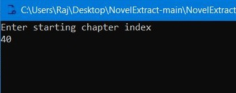
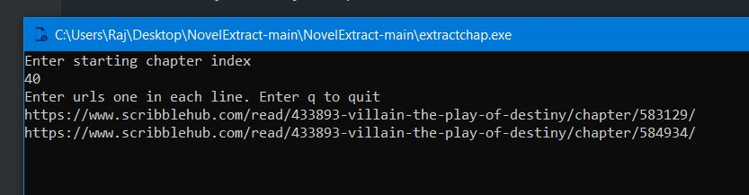

# NovelExtract

This app extracts chapters from web novel site and converts them to pdf so that you can upload them to read on your kindle.

### If you want to run the app just download everything

### Then run extractchap.exe



### Enter starting index for your chapters



### Add url to chapters line by line


### Finally enter 'q' to extract


```
Note: This only works for windows os. You can extract webnovels from scribblehub.com
```
